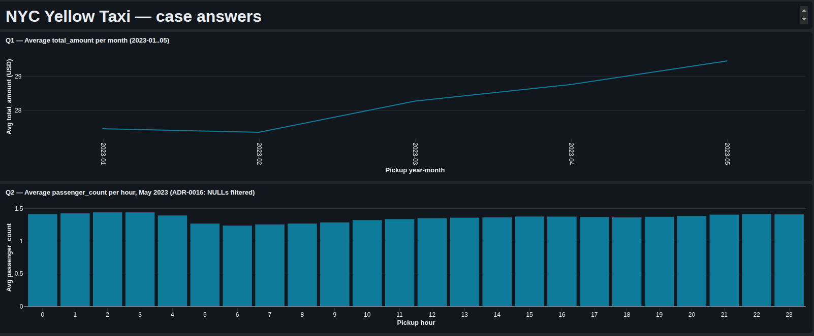
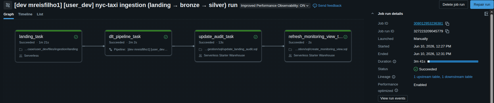
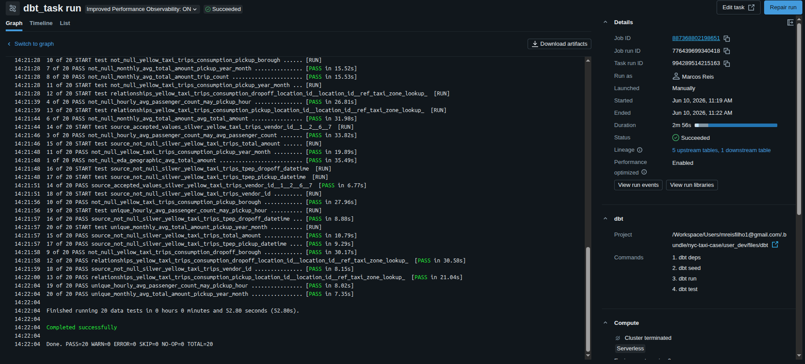
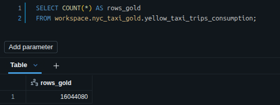
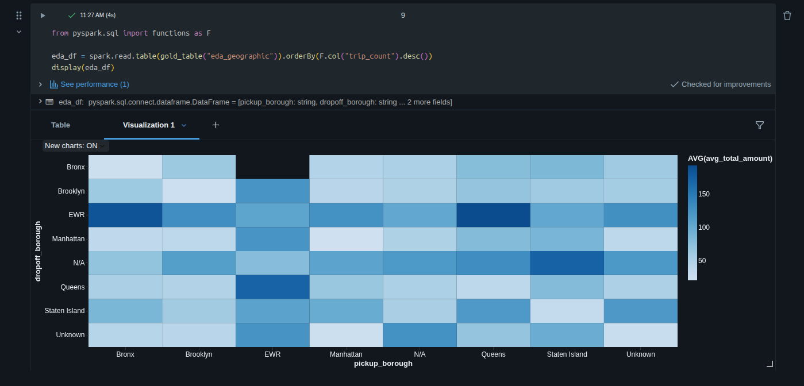

# NYC Yellow Taxi — iFood data engineering case

NYC TLC Yellow Taxi · Databricks Free Edition · DAB + DLT + dbt

**TL;DR.** No iFood as ingestões rodam em DAB + DLT e a modelagem em
dbt — repliquei exatamente esse split aqui, em monorepo com dois jobs
DAB independentes ligados só pelo contrato da Silver. Tentei trazer
também observabilidade (`landing_audit`, monitoring view sobre
`event_log`) e testes (20 dbt tests, 136 pytest, expectations DLT
warn-only), sabendo que num prazo curto isso fica longe de production-
ready. Ingestão concluída: 16M trips Jan–Mai 2023, 4 models Gold,
dashboard AI/BI publicado. Rodando em Databricks Free Edition serverless.

## As respostas do case

O dashboard é deployado pelo bundle como `[user_dev] NYC Yellow Taxi —
case answers` (resource `resources/nyc_taxi_dashboard.lvdash.json`).
Em qualquer Free Edition: `bundle deploy --target user_dev` →
Workspace UI → menu Dashboards → abrir → o print acima é o resultado.

- **Q1 — Média mensal de `total_amount` (Jan–Mai 2023):** sobe
  monotonicamente de **USD 27.44** em Jan a **USD 29.46** em Mai
  (~7.3 % no window; Maio também é o pico de volume).
- **Q2 — Média de `passenger_count` por hora em Maio 2023:** pico de
  **~1.44** passageiros/trip às **03h** (madrugada / aeroporto),
  mínimo de **~1.24** às **06h** (commute solo). NULLs nativos TLC
  (~2.95 % das rows de Maio) ficam fora do denominador — ver
  [ADR-0016](docs/adr/0016-passenger-count-warn-em-vez-de-drop.md).

EDA bônus (matriz de fluxo borough × borough) vive no notebook
exploratório — ver Print 5 mais abaixo.

## Como cheguei aqui

Dois jobs DAB independentes, sem `depends_on` cross-job. O único
contrato entre eles é a tabela Silver em Unity Catalog
(`dbt/models/sources.yml`) — espelha o que o iFood tem com
`ifp-data-ingestions` e `pagob2b-dbt` em repos separados. Aqui é
monorepo por UX do avaliador, mas a separação operacional é a mesma —
ver [ADR-0010](docs/adr/0010-fronteira-ingestao-modelagem-na-silver.md) +
[ADR-0011](docs/adr/0011-orquestracao-dois-jobs-dab-independentes.md).

**`job_ingestion`** — Landing (Volume UC) → Bronze (Streaming Table
Delta) → Silver (Materialized View canônica). 4 tasks atômicas
(download HTTP, DLT pipeline com 7 expectations warn-only, audit
backfill, monitoring view refresh), ~5 min:

**`job_dbt`** — Silver → Gold via dbt-databricks. 1 task, ~1m30s:
`dbt deps → seed (dim_locations, 265 zonas) → run (4 Gold views) →
test (20 dbt tests hard-fail)`.

## Stack e por que assim

- **Orquestração:** Databricks Asset Bundles (DAB), 2 jobs com
  schedule pausado (execução manual via `bundle run`).
- **Ingestão:** Lakeflow Declarative Pipelines (DLT) + Auto Loader
  (`cloudFiles.schemaHints` + `addNewColumnsWithTypeWidening`, ADRs
  0014/0015).
- **Storage:** Unity Catalog, Delta tables, Liquid Clustering em
  `pickup_year_month` na Silver (ADR-0006 — partição estática perde
  pra LC em Free Edition serverless).
- **Modelagem:** dbt-databricks, 4 Gold views + 1 seed
  (`dim_locations` da TLC zone lookup).
- **Consumo:** AI/BI (Lakeview) dashboard + notebook `display()` +
  SQL direto (ver "Trio de consumo" abaixo).
- **Observabilidade:** `landing_audit` (gap pré-Bronze) + view
  `gold_pipeline_observability` sobre `event_log(TABLE(bronze))`.

Resultado final, Gold filtrada pela janela ativa de `landing_audit`:

Pipeline em ASCII:

    TLC parquet ──HTTP──▶ Landing (Volume UC)
                                 │
                                 ▼  Auto Loader (Bronze ST → Silver MV)
                          ┌──────────────┐
                          │ job_ingestion│  4 tasks, ~5min
                          └──────┬───────┘
                                 │
                          Silver (UC table)  ◀── único contrato cross-job
                                 │           (dbt/models/sources.yml)
                                 ▼
                          ┌──────────────┐
                          │   job_dbt    │  1 task, ~1m30s
                          └──────┬───────┘
                                 │
                          Gold (4 views)
                        ┌────────┼─────────┐
                        ▼        ▼         ▼
                     Notebook  Dashboard  SQL ad-hoc

**Por que Free Edition?** É o ambiente que o case (e qualquer
candidato fora do iFood) consegue reproduzir gratuitamente. Custo:
sem service principal (então sem CI deploy — `bundle deploy` requer
PAT de usuário real), serverless-only (sem instance pools, sem
all-purpose clusters), warehouse com cold start ~20s. Cada uma
dessas restrições aparece como decisão consciente nos ADRs (ver
"Limitações" na seção Apêndices ou direto em `docs/adr/`).

## Trio de consumo (cobertura assimétrica)

Três surfaces de leitura sobre o **mesmo** Gold dbt (SSoT). Cobertura
diferente por persona, intencionalmente:

| Surface | Path | Cobertura | Persona |
|---|---|---|---|
| **dbt Gold models** | `dbt/models/gold/*.sql` | Q1 + Q2 + EDA (4 views materializadas) | Engenheiro/SQL — abre o `.sql`, vê a lógica, roda `dbt compile` |
| **Notebook** | `notebooks/answers.py` | Q1 + Q2 + EDA (com heatmap interativo) | Analista — explora `display()`, troca visualização, cross-checa números |
| **AI/BI dashboard** | `resources/nyc_taxi_dashboard.lvdash.json` | Q1 + Q2 apenas | Avaliador/executivo — abre URL, vê as 2 respostas literais do case |

EDA não está no dashboard porque a forma rica dela é heatmap, não
table — e heatmap em Lakeview ficou pior que `display()` no notebook:

Adicionar uma 4ª surface (Power BI, Streamlit, `/api/2.0/sql/statements`,
…) significa adicionar uma query contra `workspace.nyc_taxi_gold.*`,
não duplicar lógica analítica. SSoT em um lugar só.

## Apêndices

- **[docs/RUNBOOK.md](docs/RUNBOOK.md)** — comandos completos de
  deploy/run/troubleshoot pra reproduzir o pipeline numa Free
  Edition limpa.
- **[CONTEXT.md](CONTEXT.md)** — vocabulário load-bearing (Landing,
  Bronze, Silver, Gold, Janela de ingestão, Trio de consumo).
- **[docs/adr/](docs/adr/)** — 16 ADRs aceitas que sustentam as
  decisões load-bearing (storage, expectations, fronteira ingestão↔
  modelagem, drift TLC, ...).
- **[docs/CASE.md](docs/CASE.md)** — enunciado original iFood.
- **[notebooks/answers.py](notebooks/answers.py)** — notebook
  exploratório (mesmo conteúdo do Print 5, mas interativo).
- **[docs/notes.md](docs/notes.md)** — decisões conscientes sem ADR.

### Limitações Free Edition

Serverless-only (sem instance pools, sem all-purpose clusters); sem
service principal (então sem CI deploy); single MANAGED catalog
(`workspace`); schedules pausados (execução manual via `bundle run`);
warehouse cold start ~20s. Cada uma é justificada nos ADRs ou em
`docs/RUNBOOK.md`.
